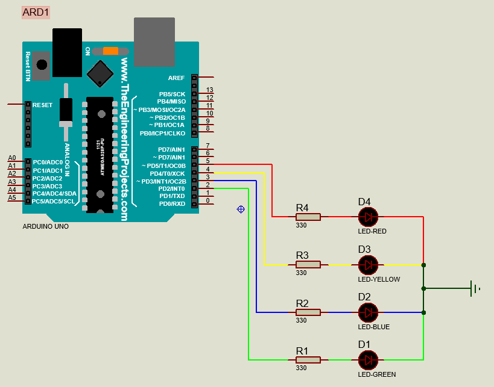

# embedded-water-depth-sensor

## Opening
This project demonstrates the implementation of a water depth sensor using an Arduino and various components. The goal is to accurately measure water depth and display the information on an LCD.

## Functions and Uses
- **Measure Water Depth:** The primary function of this project is to measure the depth of water using ultrasonic sensors.
- **Display Information:** The measured depth is displayed on an LCD screen.
- **Visual Indicators:** Different colored LEDs (Red, Yellow, Green) indicate the status of the water level.

## Components Used
- **Arduino:** The microcontroller used to control the circuit.
- **HCSR04:** Ultrasonic sensor used for measuring the distance.
- **Resistor:** Used for current limiting and protecting the components.
- **LEDs (Red, Yellow, Green):** Visual indicators for water level status.
- **LM016L:** LCD 16×2 for displaying the measured depth.
- **Power Supply:** To power the Arduino and components.
- **Ground Connection:** Essential for completing the circuit.

## Schematic Diagrams
1. **Schematic 1: Arduino and LED**
   

2. **Schematic 2: Arduino and Sensor**
   

3. **Schematic 3: Arduino and LCD 16x2**
   

4. **Complete Circuit Diagram**
   

## Flowchart
### Program Flowchart

## Explanation of the Images
- **Schematic 1:** This diagram shows how the Arduino is connected to the LEDs for visual indicators.
- **Schematic 2:** This diagram illustrates the connections between the Arduino and the HCSR04 ultrasonic sensor.
- **Schematic 3:** This diagram details how the Arduino is interfaced with the LM016L LCD.
- **Complete Circuit Diagram:** This provides an overview of the entire setup for the water depth sensor project.
- **Flowchart:** This flowchart outlines the logic and flow of the program used in the project.

## Conclusion
This project successfully integrates various components to measure and display water depth. Future improvements could include wireless data transmission and remote monitoring capabilities.
